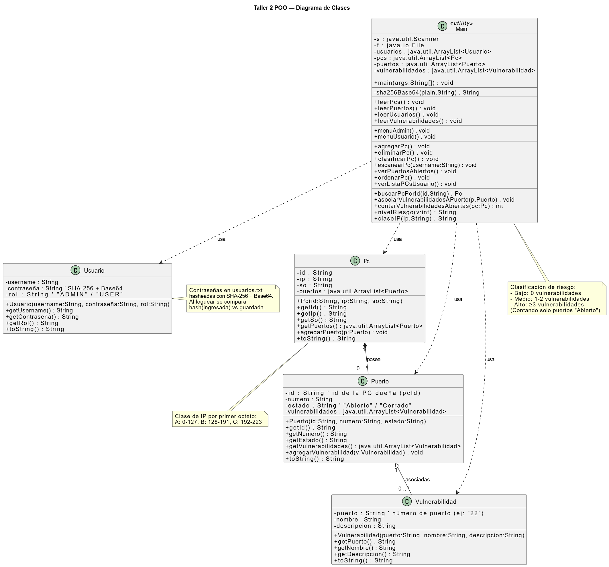

# Taller 2 - POO: Auditoría de Red SecureNet

##  Integrantes
- **Axel Alcayaga** - Ingeniería Civil en Computación e Informática - 20.832.945-6
- **Vicente Rojas** - Ingeniería Civil en Computación e Informática - 22.141.463-2

##  Resumen
Sistema de auditoría de red en Java para gestionar PCs, puertos y vulnerabilidades, con roles de administrador y usuario.

## Guía rápida para Eclipse

1. Importar el proyecto: `File → Import → Git → Projects from Git (with smart import)` e ingresar la URL del repositorio.  
2. Abrir la clase: `src/taller1/Taller1.java`.  
3. Ejecutar: clic derecho sobre la clase → `Run As → Java Application`.

## Diagramas

